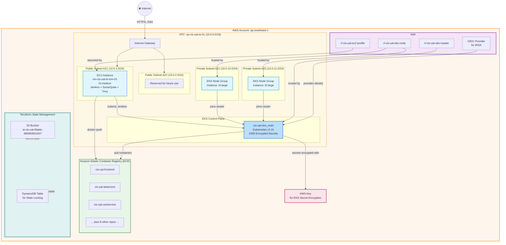

# 🗺️ Infrastructure Topology Diagram

```mermaid

graph TB
    Internet((🌐 Internet))
    
    subgraph AWS["AWS Account: ap-southeast-1"]
        subgraph VPC["VPC: vp-cis-uat-ia-01 (10.0.0.0/16)"]
            IGW[Internet Gateway]
            
            subgraph PublicAZ1["Public Subnet AZ1 (10.0.1.0/24)"]
                EC2[EC2 Instance\nvm-cis-uat-ie-tvm-01\nt3.medium\nJenkins + SonarQube + Trivy]
            end
            
            subgraph PublicAZ2["Public Subnet AZ2 (10.0.2.0/24)"]
                Reserved[Reserved for future use]
            end
            
            subgraph PrivateAZ1["Private Subnet AZ1 (10.0.10.0/24)"]
                Node1[EKS Node Group\nInstance: t3.large]
            end
            
            subgraph PrivateAZ2["Private Subnet AZ2 (10.0.11.0/24)"]
                Node2[EKS Node Group\nInstance: t3.large]
            end
            
            subgraph EKSControl["EKS Control Plane"]
                EKSCluster[cis-uat-eks_main\nKubernetes v1.31\nKMS Encrypted Secrets]
            end
        end
        
        subgraph ECR["Amazon Elastic Container Registry (ECR)"]
            Repo1[cis-uat-frontend]
            Repo2[cis-uat-adservice]
            Repo3[cis-uat-cartservice]
            Repo4[... plus 8 other repos ...]
        end
        
        subgraph IAM["IAM"]
            Role1[rl-cis-uat-ec2-profile]
            Role2[rl-cis-uat-eks-master]
            Role3[rl-cis-uat-eks-node]
            OIDCProvider[OIDC Provider\nfor IRSA]
        end
        
        subgraph State["Terraform State Management"]
            S3Bucket[S3 Bucket\nst-cis-uat-tfstate-485950501937]
            DynamoDB[DynamoDB Table\nfor State Locking]
        end
        
        KMSKey[KMS Key\nfor EKS Secret Encryption]
    end
    
    Internet -->|HTTPS, SSH| IGW
    IGW --> PublicAZ1
    IGW --> PublicAZ2
    EC2 -->|kubectl, Jenkins| EKSCluster
    EC2 -->|docker push| ECR
    EKSCluster -->|pull containers| ECR
    EKSCluster -->|secrets encrypted with| KMSKey
    Node1 -->|joins cluster| EKSCluster
    Node2 -->|joins cluster| EKSCluster
    Role2 -->|trusted by| EKSCluster
    Role3 -->|trusted by| Node1
    Role3 -->|trusted by| Node2
    Role1 -->|assumed by| EC2
    OIDCProvider -->|provides identity| EKSCluster
    S3Bucket -->|stores state| State
    DynamoDB -->|locks state| State

    style AWS fill:#fef5ec,stroke:#fb8c00,stroke-width:2px
    style VPC fill:#fff7e6,stroke:#fb8c00
    style EC2 fill:#e1f5fe,stroke:#0288d1,stroke-width:1.5px
    style Node1 fill:#e1f5fe,stroke:#0288d1,stroke-width:1.5px
    style Node2 fill:#e1f5fe,stroke:#0288d1,stroke-width:1.5px
    style EKSCluster fill:#bbdefb,stroke:#1976d2,stroke-width:2px
    style ECR fill:#e8f5e9,stroke:#388e3c,stroke-width:2px
    style IAM fill:#f3e5f5,stroke:#7b1fa2,stroke-width:2px
    style State fill:#e0f2f1,stroke:#00796b,stroke-width:2px
    style KMSKey fill:#fce4ec,stroke:#ad1457,stroke-width:2px

```