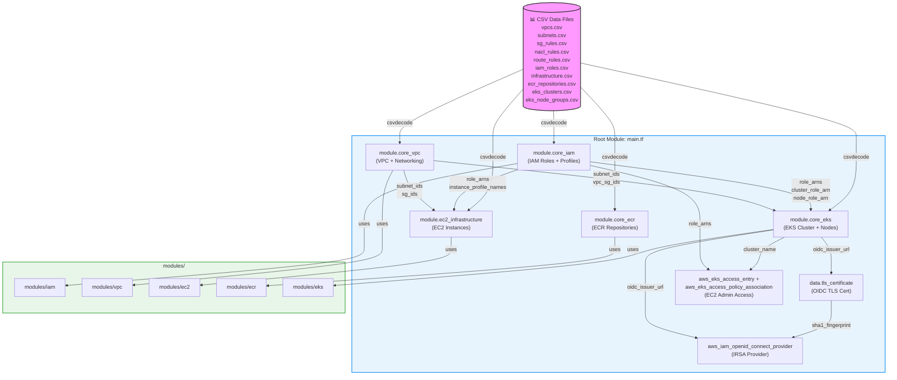

# 🔗 Module Dependency Graph

```mermaid
graph TD
    CSV[("📊 CSV Data Files\nvpcs.csv\nsubnets.csv\nsg_rules.csv\nnacl_rules.csv\nroute_rules.csv\niam_roles.csv\ninfrastructure.csv\necr_repositories.csv\neks_clusters.csv\neks_node_groups.csv")]

    subgraph ROOT["Root Module: main.tf"]
        IAM["module.core_iam\n(IAM Roles + Profiles)"]
        VPC["module.core_vpc\n(VPC + Networking)"]
        EC2["module.ec2_infrastructure\n(EC2 Instances)"]
        ECR["module.core_ecr\n(ECR Repositories)"]
        EKS["module.core_eks\n(EKS Cluster + Nodes)"]
        TLS["data.tls_certificate\n(OIDC TLS Cert)"]
        OIDC["aws_iam_openid_connect_provider\n(IRSA Provider)"]
        ACCESS["aws_eks_access_entry +\naws_eks_access_policy_association\n(EC2 Admin Access)"]
    end

    subgraph MODS["modules/"]
        MIAM["modules/iam"]
        MVPC["modules/vpc"]
        MEC2["modules/ec2"]
        MECR["modules/ecr"]
        MEKS["modules/eks"]
    end

    CSV -->|csvdecode| IAM
    CSV -->|csvdecode| VPC
    CSV -->|csvdecode| EC2
    CSV -->|csvdecode| ECR
    CSV -->|csvdecode| EKS

    IAM -->|uses| MIAM
    VPC -->|uses| MVPC
    EC2 -->|uses| MEC2
    ECR -->|uses| MECR
    EKS -->|uses| MEKS

    IAM -->|role_arns\ninstance_profile_names| EC2
    IAM -->|role_arns\ncluster_role_arn\nnode_role_arn| EKS
    VPC -->|subnet_ids\nsg_ids| EC2
    VPC -->|subnet_ids\nvpc_sg_ids| EKS

    EKS -->|oidc_issuer_url| TLS
    TLS -->|sha1_fingerprint| OIDC
    EKS -->|oidc_issuer_url| OIDC
    EKS -->|cluster_name| ACCESS
    IAM -->|role_arns| ACCESS

    style CSV fill:#f9f,stroke:#333,stroke-width:2px
    style ROOT fill:#e8f4fd,stroke:#2196F3,stroke-width:2px
    style MODS fill:#e8f5e9,stroke:#4CAF50,stroke-width:2px
```
