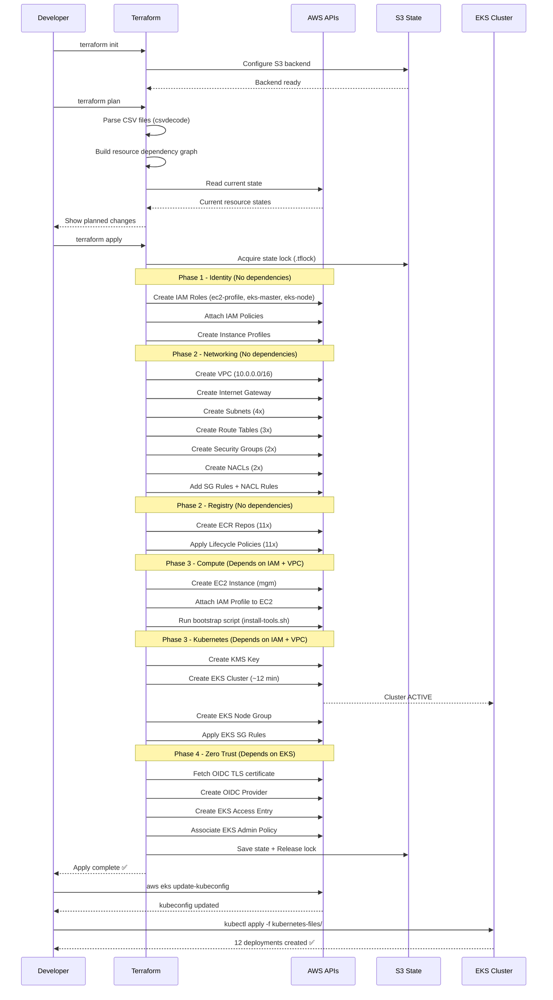

# 🔄 Resource Deployment Flow

```mermaid
sequenceDiagram
    participant DEV as Developer
    participant TF as Terraform
    participant AWS as AWS APIs
    participant S3 as S3 State
    participant EKS as EKS Cluster

    DEV->>TF: terraform init
    TF->>S3: Configure S3 backend
    S3-->>TF: Backend ready

    DEV->>TF: terraform plan
    TF->>TF: Parse CSV files (csvdecode)
    TF->>TF: Build resource dependency graph
    TF->>AWS: Read current state
    AWS-->>TF: Current resource states
    TF-->>DEV: Show planned changes

    DEV->>TF: terraform apply
    TF->>S3: Acquire state lock (.tflock)

    Note over TF,AWS: Phase 1 - Identity (No dependencies)
    TF->>AWS: Create IAM Roles (ec2-profile, eks-master, eks-node)
    TF->>AWS: Attach IAM Policies
    TF->>AWS: Create Instance Profiles

    Note over TF,AWS: Phase 2 - Networking (No dependencies)
    TF->>AWS: Create VPC (10.0.0.0/16)
    TF->>AWS: Create Internet Gateway
    TF->>AWS: Create Subnets (4x)
    TF->>AWS: Create Route Tables (3x)
    TF->>AWS: Create Security Groups (2x)
    TF->>AWS: Create NACLs (2x)
    TF->>AWS: Add SG Rules + NACL Rules

    Note over TF,AWS: Phase 2 - Registry (No dependencies)
    TF->>AWS: Create ECR Repos (11x)
    TF->>AWS: Apply Lifecycle Policies (11x)

    Note over TF,AWS: Phase 3 - Compute (Depends on IAM + VPC)
    TF->>AWS: Create EC2 Instance (mgm)
    TF->>AWS: Attach IAM Profile to EC2
    TF->>AWS: Run bootstrap script (install-tools.sh)

    Note over TF,AWS: Phase 3 - Kubernetes (Depends on IAM + VPC)
    TF->>AWS: Create KMS Key
    TF->>AWS: Create EKS Cluster (~12 min)
    AWS-->>EKS: Cluster ACTIVE
    TF->>AWS: Create EKS Node Group
    TF->>AWS: Apply EKS SG Rules

    Note over TF,AWS: Phase 4 - Zero Trust (Depends on EKS)
    TF->>AWS: Fetch OIDC TLS certificate
    TF->>AWS: Create OIDC Provider
    TF->>AWS: Create EKS Access Entry
    TF->>AWS: Associate EKS Admin Policy

    TF->>S3: Save state + Release lock
    TF-->>DEV: Apply complete ✅

    DEV->>AWS: aws eks update-kubeconfig
    AWS-->>DEV: kubeconfig updated
    DEV->>EKS: kubectl apply -f kubernetes-files/
    EKS-->>DEV: 12 deployments created ✅
```
