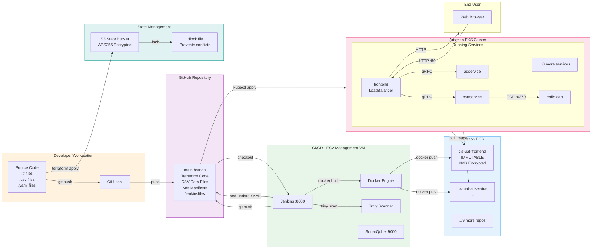

# 📊 Data Flow Diagram

```mermaid
graph LR
    subgraph DEV["Developer Workstation"]
        CODE[Source Code\n.tf files\n.csv files\n.yaml files]
        GIT_LOCAL[Git Local]
    end

    subgraph GITHUB["GitHub Repository"]
        MAIN[main branch\nTerraform Code\nCSV Data Files\nK8s Manifests\nJenkinsfiles]
    end

    subgraph CICD["CI/CD - EC2 Management VM"]
        JENKINS[Jenkins :8080]
        DOCKER[Docker Engine]
        TRIVY[Trivy Scanner]
        SONAR[SonarQube :9000]
    end

    subgraph REGISTRY["Amazon ECR"]
        ECR1[cis-uat-frontend\nIMMUTABLE\nKMS Encrypted]
        ECR2[cis-uat-adservice\n...]
        ECR3[...9 more repos]
    end

    subgraph K8S["Amazon EKS Cluster"]
        subgraph SERVICES["Running Services"]
            FE[frontend\nLoadBalancer]
            AD[adservice]
            CART[cartservice]
            MORE[...8 more services]
            REDIS[redis-cart]
        end
    end

    subgraph STATE["State Management"]
        S3STATE[S3 State Bucket\nAES256 Encrypted]
        LOCK[.tflock file\nPrevents conflicts]
    end

    subgraph USER["End User"]
        BROWSER[Web Browser]
    end

    CODE -->|git push| GIT_LOCAL
    GIT_LOCAL -->|push| MAIN

    MAIN -->|checkout| JENKINS
    JENKINS -->|docker build| DOCKER
    JENKINS -->|trivy scan| TRIVY
    DOCKER -->|docker push| ECR1
    DOCKER -->|docker push| ECR2
    JENKINS -->|sed update YAML| MAIN
    JENKINS -->|git push| MAIN

    MAIN -->|kubectl apply| K8S
    K8S -->|pull image| ECR1
    K8S -->|pull image| ECR2

    FE -->|HTTP| USER
    BROWSER -->|HTTP :80| FE
    FE -->|gRPC| AD
    FE -->|gRPC| CART
    CART -->|TCP :6379| REDIS

    CODE -->|terraform apply| S3STATE
    S3STATE -->|lock| LOCK

    style DEV fill:#fff3e0,stroke:#FF9800
    style GITHUB fill:#f3e5f5,stroke:#9C27B0
    style CICD fill:#e8f5e9,stroke:#4CAF50
    style REGISTRY fill:#e3f2fd,stroke:#2196F3
    style K8S fill:#fce4ec,stroke:#E91E63
    style STATE fill:#e0f2f1,stroke:#009688
```
